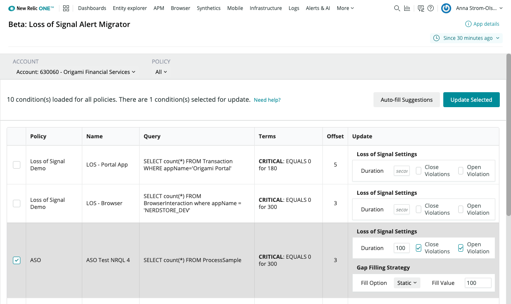

[](https://opensource.newrelic.com/oss-category/#archived)

# Loss of Signal Alerts Migrator

## Usage

Use the Loss of Signal Alerts Migrator to bulk review and edit NRQL conditions that may need Loss of Signal detection configured, in order to prevent false negatives from occuring after the rollout of New Relic One Streaming Alerts.



## Context
Throughout the month of October, 2020, New Relic is rolling out “New Relic One Streaming Alerts” for NRQL Conditions. This new platform will deliver a good number of benefits that will ultimately make alerts more accurate and reliable while delivering significant improvements in time-to-detect.  [Read about the details of this release here.](https://discuss.newrelic.com/t/announcing-new-relic-one-streaming-alerts-for-nrql-conditions/115361)

With this rollout, we will be making the entire streaming pipeline event-driven to improve reliability,  delivering official support for loss of signal detection, and allowing you to specify which gap filling strategy you wish to use.

### Critical Change in Behavior
This rollout will change behavior that you may be relying on to detect when an entity or service goes offline.  We will no longer be inserting a “0” into the alert evaluation stream when there are gaps in the data.  Gaps in data occur when there is no data for a specific aggregation window.  Therefore, if you are currently monitoring for the uptime of an entity of service using an alert condition with an evaluation that uses a “<” operator, or  “=0” , they will immediately stop working once the new streaming platform is enabled on your account.  This will result in “false negatives” if that monitored service does go down.

__To prevent this__, you MUST update all such NRQL conditions to use the new loss of signal detection capability BEFORE, or immediately after, New Relic One Streaming Alerts is enabled for your account.  If you are reading this after October 28, 2020, then you can use this to find the conditions that may no longer be working and need updating.


## Open Source License

This project is distributed under the [Apache 2 license](LICENSE).

## What do you need to make this work?

1. [New Relic One](https://newrelic.com/platform)

## Getting started

To install from the [New Relic One App Catalog](https://opensource.newrelic.com/nerdpacks/):
1. login to New Relic One,
2. click on the New Relic One Catalog launcher
3. select Loss of Signal Alerts Migrator
4. enable/configure account-level access to the application.

If you prefer, you can use the NR1 CLI to download, install, and deploy it yourself:

First, ensure that you have [Git](https://git-scm.com/book/en/v2/Getting-Started-Installing-Git) and [NPM](https://www.npmjs.com/get-npm) installed. If you're unsure whether you have one or both of them installed, run the following command(s) (If you have them installed these commands will return a version number, if not, the commands won't be recognized):

```bash
git --version
npm -v
```

Next, clone this repository and run the following scripts:

```bash
git clone https://github.com/newrelic/nr1-alerts-los-migrator.git
cd nr1-alerts-los-migrator
nr1 nerdpack:uuid -gf
npm install
npm start
```

Visit [https://one.newrelic.com/?nerdpacks=local](https://one.newrelic.com/?nerdpacks=local), navigate to the Nerdpack, and :sparkles:

## Deploying this Nerdpack

Open a command prompt in the nerdpack's directory and run the following commands.

```bash
# this is to create a new uuid for the nerdpack so that you can deploy it to your account
nr1 nerdpack:uuid -g [--profile=your_profile_name]
# to see a list of APIkeys / profiles available in your development environment, run nr1 credentials:list
nr1 nerdpack:publish [--profile=your_profile_name]
nr1 nerdpack:deploy [-c [DEV|BETA|STABLE]] [--profile=your_profile_name]
nr1 nerdpack:subscribe [-c [DEV|BETA|STABLE]] [--profile=your_profile_name]
```

Visit [https://one.newrelic.com](https://one.newrelic.com), navigate to the Nerdpack, and :sparkles:

## Community Support

New Relic hosts and moderates an online forum where you can interact with New Relic employees as well as other customers to get help and share best practices. Like all New Relic open source community projects, there's a related topic in the New Relic Explorers Hub. You can find this project's topic/threads here:

[https://discuss.newrelic.com/t/loss-of-signal-alerts-migrator/116684](https://discuss.newrelic.com/t/loss-of-signal-alerts-migrator/116684)

Please do not report issues with Loss of Signal Migrator to New Relic Global Technical Support. Instead, visit the [`Explorers Hub`](https://discuss.newrelic.com/t/loss-of-signal-alerts-migrator/116684) for troubleshooting and best-practices.

## Issues / Enhancement Requests

Issues and enhancement requests can be submitted in the [Issues tab of this repository](https://github.com/newrelic/nr1-alerts-los-migrator/issues). Please search for and review the existing open issues before submitting a new issue.

## Security

As noted in our [security policy](https://github.com/newrelic/nr1-alerts-los-migrator/security), New Relic is committed to the privacy and security of our customers and their data. We believe that providing coordinated disclosure by security researchers and engaging with the security community are important means to achieve our security goals.

If you believe you have found a security vulnerability in this project or any of New Relic's products or websites, we welcome and greatly appreciate you reporting it to New Relic through HackerOne.

## Contributing

Contributions are welcome (and if you submit a Enhancement Request, expect to be invited to contribute it yourself :grin:). Please review our [Contributors Guide](https://github.com/newrelic/nr1-alerts-los-migrator/blob/main/CONTRIBUTING.md).

Keep in mind that when you submit your pull request, you'll need to sign the CLA via the click-through using CLA-Assistant. If you'd like to execute our corporate CLA, or if you have any questions, please drop us an email at opensource@newrelic.com.

## Icon Attribution
App icon from <a href="https://www.icons8.com/" title="Icons8">Icons8</a>
